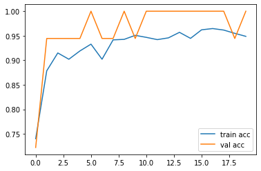
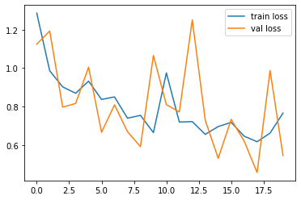
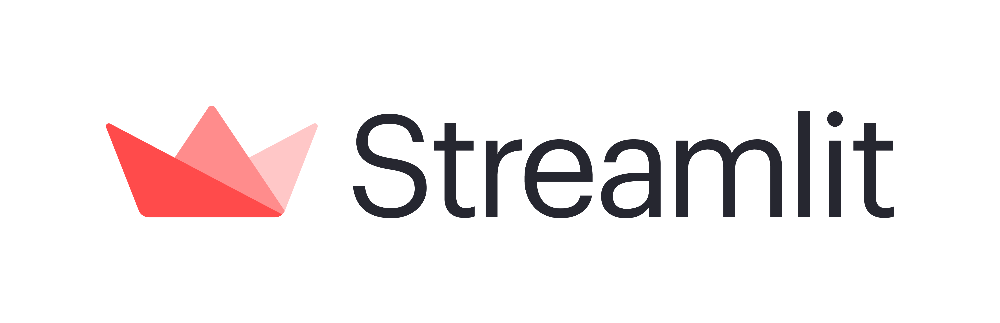

# Cotton Leaf Disease Prediction Using Transfer Learning🌿

<p align="center">
  
</p>

## 📌 Introduction

This Deep Learning Web Application is build using Tensorflow-Keras in this we have used Transfer Learning in which we are using RESNET152V2 Architecture, this web application classify images of the diseased cotton leaf,fresh cotton leaf,diseased cotton plant and fresh cotton plant.During creating a perfect model we have trained this Cotton Leaf Image Dataset with Different Transfer Learning Architectures.Our model performs fairly good over 20 epochs with an Validation Accuracy of 0.99 on a batch size of 32.This provides a handy tool to utilize the power of Machine Learning and Artificial Intelligence in Image Classification Problems where time and accuracy is the paramount objective of classification.

## 🤖 **Benchmarks of Different Transfer Learning Architecture on our Dataset:**

**1. InceptionNetV3 Performance:**

<p align="center">
  
</p>

<p align="center">
  
</p>

`loss: 0.5233 - accuracy: 0.9487 - val_loss: 0.0012 - val_accuracy: 1.0000`

**2. RESNET50 Performance:**

<p align="center">
  
</p>

<p align="center">
  
</p>

`loss: 0.7661 - accuracy: 0.7355 - val_loss: 0.5443 - val_accuracy: 0.7778`


**3. RESNET152V2 Performance:**

<p align="center">
  
</p>

<p align="center">
  
</p>

`loss: 0.2298 - accuracy: 0.9800 - val_loss: 1.8554e-05 - val_accuracy: 1.0000` 

***As we have seen that RESNET152V2 is Performing best in comparasion to all other Transfer Learning Architecture,So we have picked up RESNET152V2 Architecture and Trained Our Model over it!!*** 


## 🎯 Purpose of the Project

India is the largest producer of cotton in the world. The United States Department of Agriculture (USDA) pegs India’s cotton production at 29 million bales in the 2019-20 season as against 26 million bales the previous year. The latest figures mean that India is all set to surpass China, which has a projection of 27.75 million bales for the same season.
However, despite these impressive numbers, the productivity per hectare is starkly low.The production of cotton in india reducing gradualy over year because of major cotton diseases which impact their production very much some common diseases like insect attack,charcol rot and many are making heavy impact over their plantation.Due to this many cotton cultivators farmer get a huge drop down in their production and income.The problem will be solved if the farmer get to know about the plants which are infected and diseased in early stages of their growth so that farmers can use pesticides and different medicinal equipments to sprinkles medicines over plants and save their crops from diseases in early stages of production.***As this project will help the farmers to recognize the cotton plants which are Fresh and Diseased by simply uploading the pictures of the cotton plants on the web app.On further Production level this web app can be deployed as a android app which can make the farmers to click and upload their cotton plant picture and get results on the spot instantly.***

<p align="center">
  
</p>

## 🏁 Technology Stack

* [Streamlit](https://www.streamlit.io/)
* [Flask](https://github.com/pallets/flask)
* [Tensorflow 2.x](https://www.tensorflow.org/)
* [Keras-Transfer-Learning](https://keras.io/api/applications/)

## 🏃‍♂️ Local Installation

1. Drop a ⭐ on the Github Repository. 
2. Clone the Repo by going to your local Git Client and pushing in the command: 

```sh
git clone https://github.com/DARK-art108/Cotton-Leaf-Disease-Prediction.git
```
3. Install the Packages: 
```sh
pip install -r requirements.txt
```
## Run your Flask APP
**Credits given to my Best Friend [Param Siddharth](https://github.com/paramsiddharth) for his awesome work over Frontend Build!!**

<p align="center">
  
</p>

Run the Flask App using this CMD:
```sh
flask run
```
INFO:     Flask App running on http://127.0.0.1:5001 / Or on your metioned PORT No

## Frontend Using Streamlit

<p align="center">
  
</p>

1.Run your Streamlit App

```sh
streamlit run {Name_of_Your_Streamlit_App}.py

```

For this Project Run this CMD:

`streamlit run streamlit_app.py`

## 📋 Further Changes to be Done

- [ ] Dockerizing the application.
- [ ] Train model more effectivly using more Data Augumentation Techniques.
- [ ] Deploying the Web Application on Cloud.
     - [ ] AWS BeanStalk
     - [ ] Google Cloud Platform
     - [ ] Azure
     
 ## 📜 LICENSE

[MIT](https://github.com/DARK-art108/Cotton-Leaf-Disease-Prediction/blob/main/LICENSE)

## 📊 Repo Stats


[](https://github.com/Naereen/StrapDown.js/blob/master/LICENSE)


[](https://GitHub.com/Naereen/StrapDown.js/graphs/commit-activity)
[](http://perso.crans.org/)
[](https://www.python.org/)

